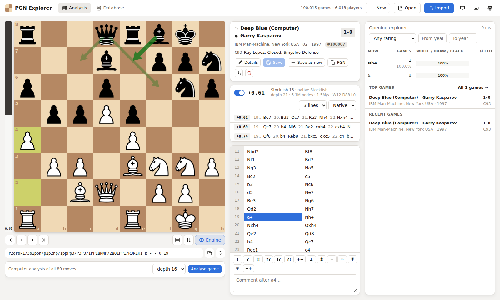
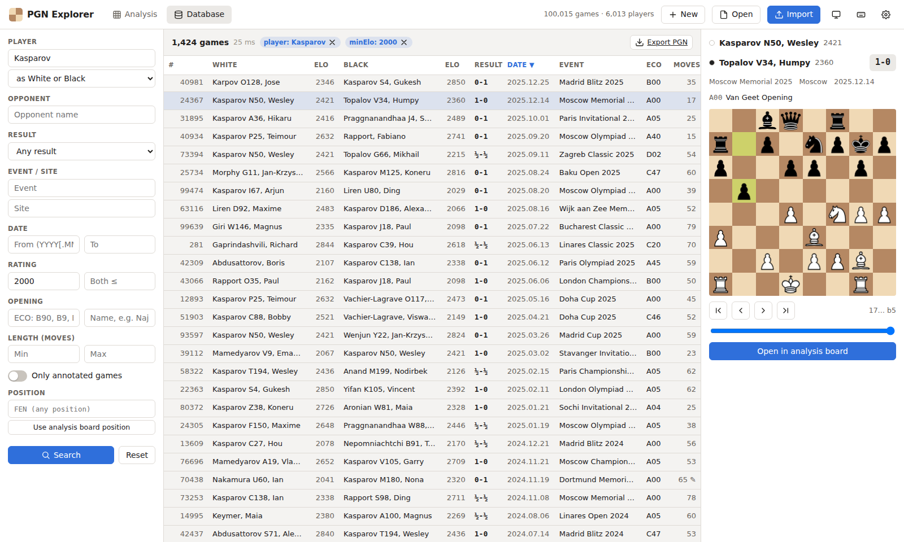
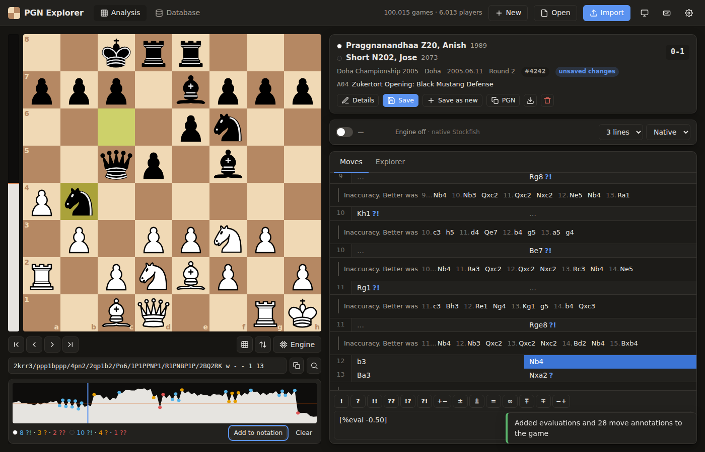
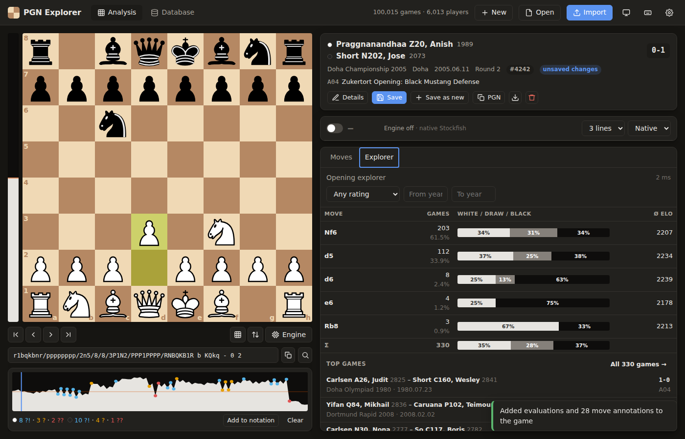

# PGN Explorer

A fast, local-first chess database and analysis app. Import PGN files with
millions of games, search them by player, event, date, rating or opening, find
every game that reached a position, browse an opening explorer with
win/draw/loss statistics, and analyse positions or whole games with Stockfish.
Everything runs on your machine. The web UI talks to a small local server that
keeps the games in a single SQLite file.



## Features

**Game viewer and editor**
- Interactive board: drag-and-drop or click-to-move, legal-move hints, move
  animation, promotion picker, flip, right-click arrows/circles, mouse-wheel
  navigation, four board colour themes, light/dark mode.
- Move tree with unlimited nested variations, comments and NAGs (!, ?, ±, …);
  promote/delete variations, "make main line"; keyboard navigation.
- Comment commands from lichess/ChessBase: `[%cal]` arrows and `[%csl]` squares
  are drawn on the board, `[%clk]` clock times are shown next to moves.
- Edit game headers, save games to the database, copy or download PGN.
- Open or paste PGN (many games at once, parsed lazily) or a FEN; visual
  position set-up with validation.

**Database**
- Streaming, multi-threaded PGN import (UTF-8 or Latin-1, BOM/CRLF tolerant,
  lenient SAN parsing, duplicate detection, error reporting). About
  **14,000 games/s** for parsing and writing, and **1 million games in 2½
  minutes** including index building on a 4-core machine.
- Search by player (substring, either colour, opponent, result relative to
  the player), event, site, date range, Elo range, ECO code/range, opening
  name, game length, annotated games, and **position** (transpositions
  included). Queries typically run in 1–25 ms on a million games.
- Virtualized game list that scrolls through the whole result set, sortable
  columns, and a live preview board.
- Export any search result, or the whole database, as PGN.

**Opening / position explorer**
- For any position: every move played, game counts, White/Draw/Black bars,
  average rating, games that ended there, top-rated and most recent games.
- Filters by average Elo and year range. Hot positions are cached.
- Openings are named from the lichess opening table (3,800+ names, matched by
  position, so transpositions are recognised).

**Stockfish**
- Native Stockfish via the local server if it is installed (multi-threaded,
  full strength); otherwise Stockfish 19 WebAssembly runs in the browser.
- Multi-PV lines in SAN (click to play them), evaluation bar, best-move
  arrows, depth/nodes/NPS and win/draw/loss.
- **Whole-game analysis**: evaluation graph, inaccuracy/mistake/blunder
  detection, and one click to write the evaluations, NAGs and better lines
  into the game.

| Database browser | Whole-game analysis | Opening explorer |
|---|---|---|
|  |  |  |

## Quick start

Requires Node.js 20+.

```bash
npm install
npm run build
npm start            # → http://localhost:3000
```

Then drop PGN files onto **Import**, or use the CLI for very large files:

```bash
npm run cli -- import ~/Downloads/twic*.pgn        # into data/pgnx.sqlite
npm run cli -- stats
```

For the native engine, install Stockfish (`apt install stockfish`,
`brew install stockfish`, or download it from stockfishchess.org). It is found on
`PATH`, in the usual install locations, or through `STOCKFISH_PATH=/path/to/stockfish`.
Without it, the browser engine is used automatically.

Options: `--db FILE` (or `PGNX_DB`), `--port` (`PORT`), `--host` (`HOST`,
default `127.0.0.1` so the server is only reachable from your machine). The
server rejects cross-origin requests and unexpected `Host` headers, so other
websites cannot drive it (CSRF, WebSocket hijacking or DNS rebinding) while it
runs. The engine bridge only forwards a safe subset of UCI commands.

## Command line

```
pgnx serve   [--db FILE] [--port 3000] [--host 127.0.0.1]
pgnx import  FILE... [--db FILE] [--index-plies 60] [--no-dedupe] [--strip-annotations] [--workers N]
pgnx export  [--db FILE] [--out FILE] [filters]
pgnx search  [--db FILE] [filters] [--limit 20]
pgnx explore [--db FILE] [--fen FEN | --moves "e4 e5 Nf3"] [--min-elo N]
pgnx stats   [--db FILE]

Filters: --player --color white|black --opponent --white --black --event --site
         --from YYYY[.MM.DD] --to YYYY[.MM.DD] --result 1-0|0-1|1/2-1/2|win|loss|draw
         --min-elo --max-elo --eco B90|B9|B90-B99 --opening NAME --fen FEN
```

(`npm run cli -- <command>` runs the built CLI from the repository.)

```
$ pgnx explore --db bench/out/1m.sqlite --moves "e4 e5"      # synthetic benchmark data
rnbqkbnr/pppp1ppp/8/4p3/4P3/8/PPPP1PPP/RNBQKBNR w KQkq - 0 2  —  C20 King's Pawn Game
37,518 games (27 ms)
  Nc3          13,652  W 33% D 33% B 34%  Ø2226
  Nf3          13,533  W 32% D 34% B 34%  Ø2224
  Ne2           7,725  W 33% D 34% B 33%  Ø2221
  ...
```

## Architecture

```
packages/
  core/     Chess logic in TypeScript, no dependencies: move generation, SAN/UCI/FEN,
            Polyglot Zobrist hashing, PGN tokenizer/parser/writer, move trees,
            opening classification, compact move codec. Shared by server and web.
  server/   Node.js: SQLite database (better-sqlite3), parallel importer, search,
            explorer, PGN export, Stockfish WebSocket bridge, HTTP API (Fastify), CLI.
  web/      React + Vite single-page app (board, notation, explorer, engine, database).
bench/      Synthetic PGN generator and import/query/parser benchmarks.
scripts/    Dev runner and the end-to-end browser test.
```

### Chess core

A 64-square mailbox board with precomputed attack tables and make/unmake.
Legal moves come from generating pseudo-legal moves and discarding those that
leave the king in check. SAN is parsed without full move generation (reverse
attack lookup from the destination square), which is what makes imports fast.
Position hashes use the **Polyglot Zobrist keys**, so hashes match Polyglot
opening books. The generator is verified by perft on the standard test
positions, and SAN, FEN, hashes, legal moves and mate/stalemate detection are
checked against **python-chess** on more than 10,000 plies of generated games
(`packages/core/scripts/gen-reference.py`).

### Database layout (SQLite)

| Table | Contents |
|---|---|
| `games` | Normalised header fields (player/event/site ids, `date` as yyyymmdd, result, Elo, ECO, opening), main line as **2 bytes per ply**, original movetext only for annotated games, other tags as JSON, and a duplicate fingerprint. |
| `players`, `events`, `sites`, `openings` | Name lookup tables (case-insensitive unique). |
| `positions` | The position index: `(hash, move, game_id)` → ply, result, average Elo, year for the first 60 plies of every game (configurable). `WITHOUT ROWID`, clustered on the key. |
| `explorer_cache` | Cached explorer results for expensive positions, invalidated on change. |

Keying the position index on `(hash, move, …)` means the explorer's
"GROUP BY move" follows the index order with no sort. Finding games by
position is a range scan on the hash. Each position is recorded once per game,
even if it repeats.

### Import pipeline

1. The file is streamed in 4 MB chunks, decoded (UTF-8, falling back to
   Windows-1252) and split into games by a small state machine that
   understands tags and multi-line comments.
2. Batches of 500 games go to worker threads that tokenize, replay and
   validate the moves, compute position hashes, classify the opening and pack
   everything into typed arrays, which are transferred back without copying.
3. The main thread writes results in file order inside transactions (one
   multi-row `INSERT` per game for its positions). For large or bulk imports,
   positions go to a temporary staging database and are merged into the index
   in one sorted pass at the end. Secondary indexes are dropped and rebuilt
   when importing into an empty database.

In the server, imports run as background jobs in a worker thread with their
own connection (WAL mode). The UI stays responsive and shows live progress.

## Performance

Measured on a 4-core cloud VM with a synthetic 1,000,000-game database
(`npm run bench:generate`, 774 MB of PGN, games of 30–160 plies from a
skewed opening distribution, 4% annotated):

| Operation | Result |
|---|---|
| Import, parse + write | **71 s, 14,100 games/s** |
| Import, total incl. position-index merge and indexes | **140 s, 7,100 games/s** |
| Database size | 2.33 GB (57M indexed positions, about 2.3 KB/game) |
| Explorer, start position (1M games), uncached / cached | ≈300 ms / 0.3 ms |
| Explorer after 1.e4 (175k games), uncached | ≈50 ms |
| Explorer, typical opening position | 1–20 ms |
| Search: player substring (48k matches) | 25–30 ms |
| Search: both players ≥ 2700 | 1 ms |
| Search: player + date + Elo + colour | 9 ms |
| Search: games reaching a position | < 1 ms |
| Load and format one game | 0.4 ms |

Single-thread core throughput (`npm run bench:parse`): SAN replay with hashing
**2.1M plies/s**, PGN tokenizing 42k games/s, perft 4.3M nodes/s.

Reproduce the numbers:

```bash
npm run bench:generate -- 1000000 bench/out/1m.pgn
npm run bench:import  -- bench/out/1m.pgn bench/out/1m.sqlite   # prints the import table above
npm run bench:queries -- bench/out/1m.sqlite
npm run bench:parse   -- bench/out/1m.pgn
```

## HTTP API

| Method & path | Description |
|---|---|
| `GET /api/info` | Version, database statistics, engine availability |
| `GET /api/games?…` | Search (query parameters as in the CLI filters, plus `sort`, `order`, `offset`, `limit`) |
| `GET /api/games/:id` | Game as PGN plus headers |
| `POST /api/games` / `PUT /api/games/:id` / `DELETE /api/games/:id` | Create / replace / delete a game (`{"pgn": "…"}`) |
| `GET /api/explorer?fen=…&minElo=&maxElo=&yearFrom=&yearTo=` | Explorer statistics for a position |
| `GET /api/suggest/players?q=…` | Autocomplete for players, events, sites |
| `POST /api/import?name=…&dedupe=1` | Upload a PGN file (raw body); returns a job |
| `GET /api/jobs/:id` / `DELETE /api/jobs/:id` | Import progress / cancel |
| `GET /api/export?…` / `POST /api/export {"ids": […]}` | Stream PGN |
| `WS /api/engine` | UCI bridge to native Stockfish (safe subset of commands) |

## Development

```bash
npm run dev          # API server (auto-reload) + Vite dev server on http://localhost:5173
npm test             # unit/integration tests (core, server, web logic)
npm run typecheck
npm run build && npm run test:e2e   # headless-browser end-to-end smoke test
```

The workspace packages resolve each other's TypeScript sources through the
`development` export condition, so `npm run dev`, the tests and the benchmarks
need no build step. `npm run build` produces `packages/*/dist`.

Tests cover perft; the python-chess differential tests; PGN parsing and
round-tripping on real games (Kasparov–Deep Blue and others); importer edge
cases (Latin-1, CRLF, junk, duplicates, multi-file); explorer counts checked
against brute force; search filters; editing that keeps the index consistent;
the HTTP API; the engine bridge, including its command sanitizer; and UI
logic. The end-to-end test drives the real app in Chromium: import, search,
open, explorer, moves, engine and editor.

## Limitations

- Standard chess only. Games with a non-standard `Variant` (e.g. Chess960) are
  reported and skipped during import.
- The position index covers the first 60 plies of each game by default
  (`--index-plies` sets this when creating a database). Deeper positions are
  not found by the explorer or position search.
- One database per server process.

## Credits and licences

- Stockfish 19 (WebAssembly build by the stockfish.js project), GPLv3:
  `packages/web/public/engine/` with its licence text.
- Chess piece set "cburnett" by Colin M.L. Burnett (GPLv2+ / BSD / GFDL),
  via lichess chessground.
- Opening names from [lichess-org/chess-openings](https://github.com/lichess-org/chess-openings) (CC0).
- Polyglot Zobrist keys from the Polyglot book format specification.
- Test fixtures include sample games from the python-chess test suite.
